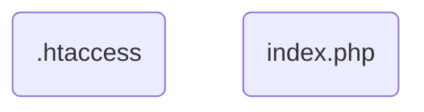
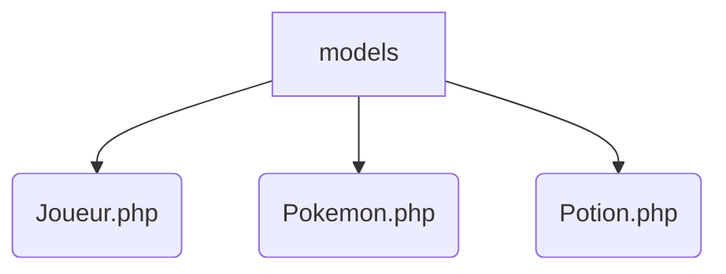
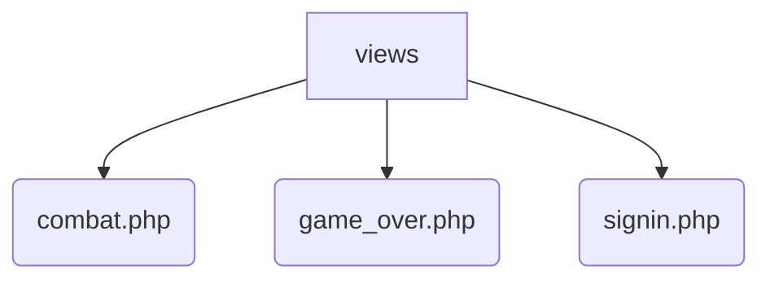
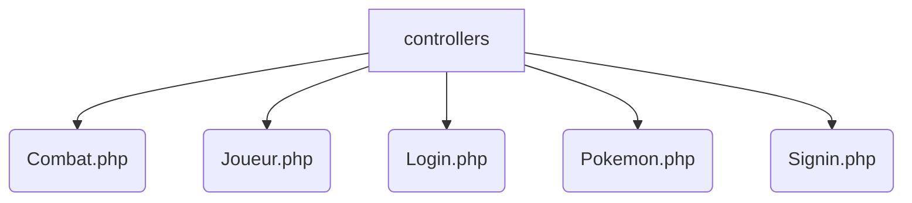
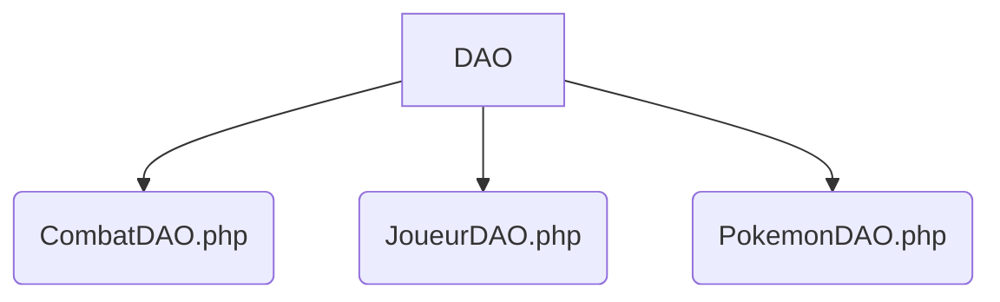
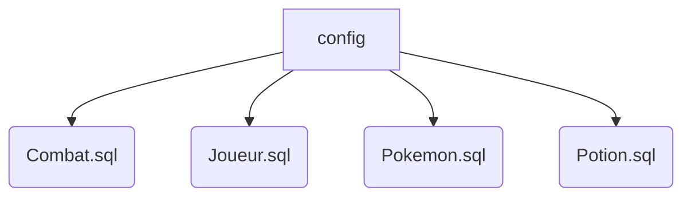
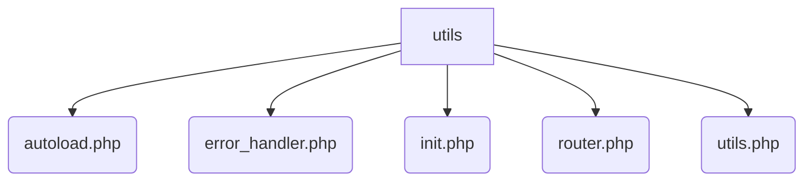
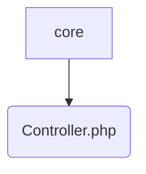

Pokéfight!
===

Elevez et envoyez à la mort vos Pokémons gratuitement !
---
> Site-web de jeu (solo ou duo) permettant d'envoyer en combats illégaux ses Pokémons et de se faire un maximum de points

### Auteur
Diane (MogwaiRGod)

# Table des matières
0. [Installation](#installation)
    1. [Prérequis](#prérequis)
    2. [Installation](#installation)
1. [Introduction](#introduction)
    1. [Contexte du projet](#contexte)
    2. [Description du projet](#description)
2. [Architecture](#architecture)
    1. [Organigramme](#organigramme)
    2. [Architecture détaillée](#architecture)
        0. [racine](#racine)
        1. [models](#models)
        2. [views](#views)
        3. [controllers](#controllers)
        4. [Compléments du MVC](#compléments)
            1. [DAO](#DAO)
            2. [core](#core)
        5. [autres](#autres)
            2. [config](#config)
            3. [utils](#utils)
3. [Technologies](#technologies)
4. [Fonctionnement](#fonctionnement)
5. [Utilisation (client)](#utilisation)

 
 

# Installation
## Prérequis
## Installation

# Introduction
## Contexte du projet
## Description du projet

# Architecture
## Organigramme

## Architecture détaillée
### racine
### models
Voir **Pokéfight_diagrammes** pour les diagrammes de classe. 
### views
### controllers
### Compléments du MVC
#### DAO
#### core
### autres
#### config
#### utils

# Technologies

# Fonctionnement

# Utilisation (client)
