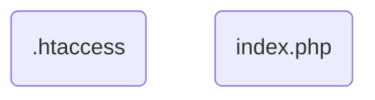
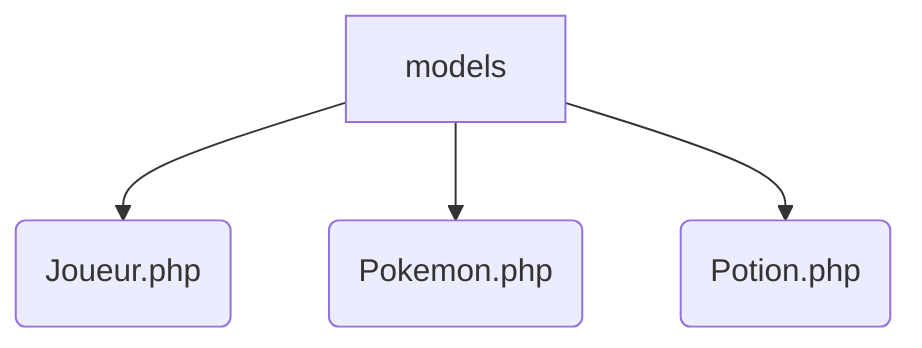
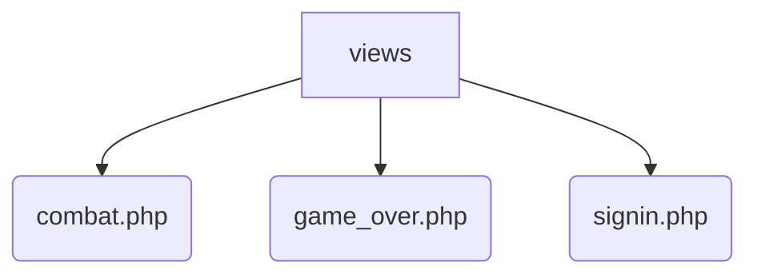
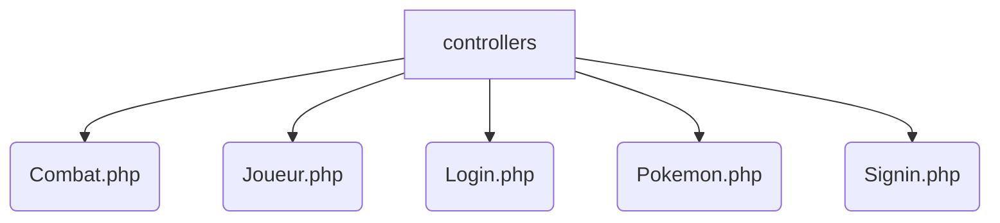
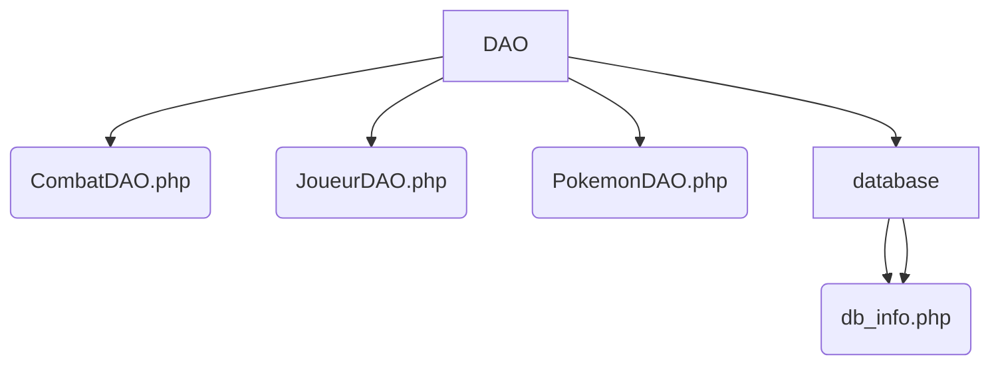
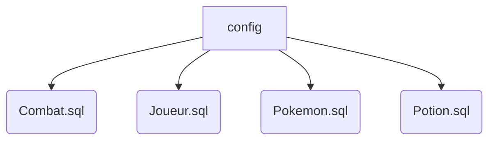
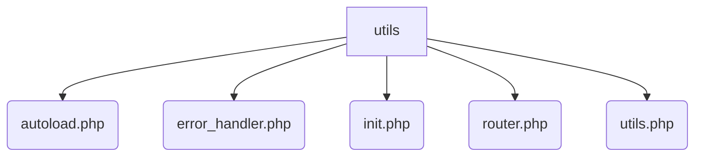
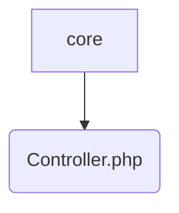

Pokéfight!
===

Elevez et envoyez à la mort vos Pokémons gratuitement !
---
> Site-web de jeu (solo ou duo) permettant d'envoyer en combats illégaux ses Pokémons et de se faire un maximum de points

### Auteur
Diane (MogwaiRGod)

# Table des matières
0. [Installation](#installation)
    1. [Prérequis](#prérequis)
    2. [Installation](#installation)
1. [Introduction](#introduction)
    1. [Contexte du projet](#contexte-du-projet)
    2. [Description du projet](#description-du-projet)
2. [Architecture](#architecture)
    1. [Organigramme](#organigramme)
    2. [Architecture détaillée](#architecture-détaillée)
        1. [racine (/)](#racine)
        2. [/models](#models)
        3. [/views](#views)
        4. [/controllers](#controllers)
        5. [Compléments du MVC](#compléments)
            1. [/DAO](#DAO)
            2. [.core](#core)
        6. [autres](#autres)
            1. [/config](#config)
            2. [/utils](#utils)
3. [Technologies](#technologies)
4. [Fonctionnement](#fonctionnement)
5. [Utilisation (client)](#utilisation)

 
 

# Installation
Le site fonctionne en local.

## Prérequis
1. Importer le programme dans un **container PHP et mysql** et le mettre à la racine.
2. Créer une base de données et vérifier que son nom/l'utilisateur/le mot de passe correspondent aux données dans ``/DAO/db_info.php``. Importer les structures de table (``/config``) dans la BDD (à l'aide d'une invite de commande ou d'une interface MYSQL, e.g ``MySQLWorkbench`` ou ``PHPMyAdmin``).
3. Dans le container, vérifier que ``a2enmod`` est activé. Entrer :  
``a2enmod rewrite`` 
Cela permet l'utilisation du fichier ``.htaccess`` (nécessaire).

## Installation
Aucune autre démarche n'est nécessaie. 
Pour ouvrir le site, ouvrir un navigateur et entrer ``localhost``.

# Introduction
## Contexte du projet
Ce projet a été réalisé dans le cadre d'une formation en développement web. Il a pour but d'évaluer la mise en place d'un projet respectant une **architecture MVC**, **l'application du langage PHP et de la POO**, et d'autres compétences (création/gestion d'une BDD, fonctionnalités de signin/login etc.)

## Description du projet

# Architecture

## Organigramme

## Architecture détaillée

### **racine (/)**
| Fichier | Contenu |
|:--:|:--|
| .htaccess | Fichier permettant la réécriture des URL du script. Les URL seront alors sous forme ``localhost/param/param..`` au lieu de ``localhost?p=param&p2=param2...``|
| index.php | Page d'accueil = point d'entrée du site |

### **/models**
Les modèles sont les classes d'objets. Elles effectuent la **logique métier**.
> Voir **Pokéfight_diagrammes** pour les diagrammes de classe.

| Classe | Méthodes |
|:--:|:--|
| Joueur.php | / |
| Pokemon.php | Attaquer, boire des potions... |
| Potion.php | / |

### **/views**

### **/controllers**
Les controllers sont des classes qui vont effectuer les actions des pages demandées par l'utilisateur. 
| Classe | Méthodes |
|:--:|:--|
| Combat.php | Lance un combat |
| Login.php | Permet la connexion utilisateur |
| Signin.php | Permet l'inscription utilisateur |

### Compléments du MVC
#### **/DAO**
Les DAO (Data Access Objects) sont une couche supplémentaire d'accès aux données. Le client interagit avec ces objets. Ils effectuent les **actions du CRUD**.
| DAO |
|:--:|:--|
| CombatDAO.php |
| JoueurDAO.php |
| PokemonDAO.php |

#### **/core**
Contient les éléments fondamentaux du programme. Ici, il va simplement contenir le controller de base.
| Fichier | Fonctionnalités |
|:--:|:--| 
| Controller.php | Classe abstraite. Permet de définir du contenu à afficher dans les pages, et d'afficher ce contenu. |

### autres
#### **/config**
Ce dossier n'est pas nécessaire au fonctionnement du site. Il contient simplement des fichiers à utiliser manuellement pour l'installation du programme, à savoir la **structure des tables de la BDD.** 
> Voir **pokefight_diagrammes** pour le MCD/MLD des tables

| Table | Commentaire |
|:--:|:--| 
| Combat.sql | Table relationnelle servant essentiellement à dégager des **statistiques** de combat |
| Joueur.sql |  |
| Pokemon.sql |  |
| Potion.sql | |

#### **/utils**
Ce répertoire contient toutes les fonctionnalités n'appartenant à aucune des catégories plus haut.
| Fichier | Fonctionnalité | 
|:--:|:--|
| autoload.php | Contient une fonction permettant d'importer (donc de déclarer) toutes les classe nécessaires au programme |
|error_handler.php | Active l'affichage des errors, et autorise le report de *toutes* les erreurs |
| router.php | Le router |
| utils.php | Contient les constantes définissant les chemins de base, ainsi que li'import du controller principal (celui dont découlent tous les controllers) |
| **init.php** | **Contient tous les fichiers d'utils => à importer au début du script (``index.php``)** |

# Technologies

# Fonctionnement

# Utilisation (client)
